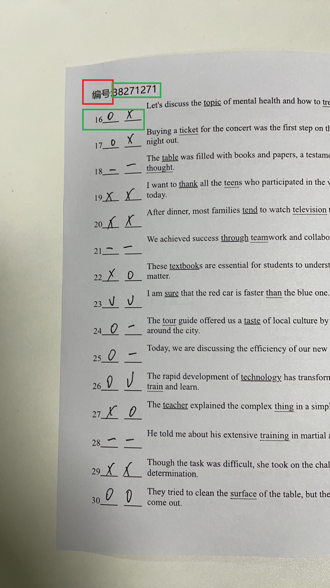
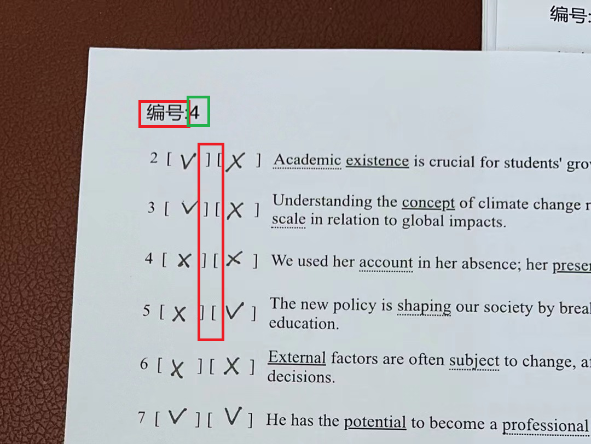

## 说明   

|项目| 详细 |  备注|    
|--- | ----| ----|     
|全图尺寸 宽 x 高 | 1080 x 1920|-|     
|`编号:` | 作为模板匹配基准 opencv `matchTemplate` | y_offset <=360 内搜索 <br> 注意：matchTemplate api 对缩放敏感，要求模板图像和待搜索图像的目标图像尽可能保持相同的宽高   ！！！  是否先选取 roi  |     
|文本定位 | 直接使用文本块区域检测模型进行文本块定位| 参考 opencv dnn模块样例 或 learnopencv 样例 <br> https://docs.opencv.org/3.4/db/da4/samples_2dnn_2text_detection_8cpp-example.html|       
|文本筛选 | 选取`编号`，手写区域符号| -|       


|样式1| 样式2|    
|--- | ----|    
|||    


精确定制方法      
   


```
pip --version   

pip install opencv-python 
```
